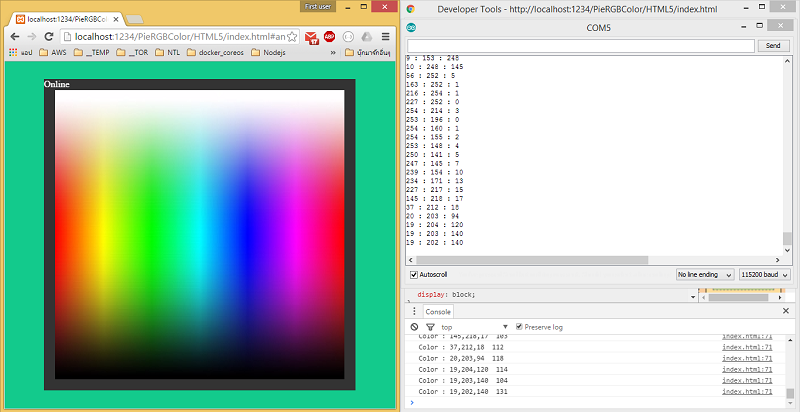

# PieRGBColor

Controller RGB With NETPIE
ควบคุมเปลี่ยนสี RGB ผ่าน NETPIE แบบ Realtime

## การใช้งาน

  นำไฟล์ HTML ไปไว้ที่ host server ที่ต้องการ เข้าใช้งานโดยการนำ APPID, KEY และ SECRET ที่ได้จากการ Create Application Key  ก่อนอื่นต้องสร้าง Application ID ก่อน ที่ https://netpie.io/app วางต่อหลัง # เพื่อ auth กับระบบ NETPIE

  http://localhost/PieRGBColor/HTML5/index.html#APPID:KEY:SECRET
  
  

  Video : https://youtu.be/CwAG0iEhSQw